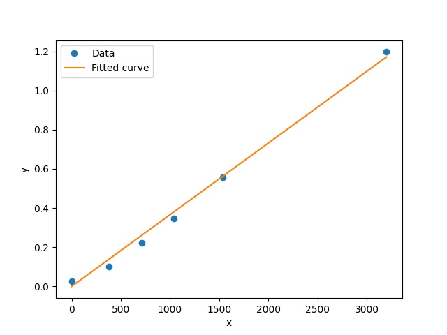

<h1 align="center">用Scipy库中<code>least_squares</code>函数求解变量有界的非线性最小二乘问题</h1>

最近接触到了`Scipy`中`optimize`模块的一些函数，`optimize`模块中提供了很多数值优化算法，其中，最小二乘法可以说是最经典的数值优化技术了， 通过最小化误差的平方来寻找最符合数据的曲线。但是由于我这边的需求是一个有界函数的拟合，所以网上资料介绍比较多的`leastsq`函数就不太适用。

## 简介

首先来看一下`least_squares`入参：

```python
def least_squares(
        fun, x0, jac='2-point', bounds=(-np.inf, np.inf), method='trf',
        ftol=1e-8, xtol=1e-8, gtol=1e-8, x_scale=1.0, loss='linear',
        f_scale=1.0, diff_step=None, tr_solver=None, tr_options={},
        jac_sparsity=None, max_nfev=None, verbose=0, args=(), kwargs={}):
```

入参相当的多，一般来说，使用`least_squares`函数只需要关注以下四个参数：

- `func`：[残差](https://baike.baidu.com/item/残差/5162512) 函数，即真实数据的`y`值与拟合得到的`y`值的差值
- `x0`：表示函数的参数，即需要拟合函数的方程中，除`x`和`y`之外的未知数。其值不影响最终拟合的结果，只影响计算的速度，故可写入随机数。
- `bounds`：自变量的上下界，默认为无界限。每个数组必须与参数`x0`的大小相匹配。
- `args`：传递给`fun`的其他参数（`fun(x, *args, **kwargs)`由于参数`jac`这里不关注，所以省略不提）。

## 举个栗子

### 设定拟合函数的形状

```python
def func(p, x):
    """
    Define the form of fitting function.
    """
    k, b = p
    return k * x + b
```

### 定义残差函数

```python
def error(self, p, x, y):
    """
    Fitting residuals.
    """
    return y - self.func(p, x)
```

### 定义拟合函数

```python
def fit_func(self, data_x, data_y):
    
    """
    这里 p0 存放的是k、b的初始值，这个值会随着拟合的进行不断变化，使得误差
    error的值越来越小
    """
    x0 = np.random.rand(2)
    
    fit_res = optimize.least_squares(self.error, x0,
                                     args=(data_x, data_y),  # 将残差函数中的除p之外的参数都打包至args中
                                     bounds=((0, 0), (1000, np.inf)))  # 定义了两个边界值，0~1000和0~+∞。
    # 拟合得到的结果是一个形如字典的 OptimizeResult 对象
    print(dict(fit_res))
    return dict(fit_res)
```

#### 拟合返回值

```python
"""
x 字段中的数据，就是此次拟合中残差函数中的 p（x 的值与 least_squares 入参中的 x0 对应）
"""
{'x': array([3.65854918e-04, 6.47578756e-16]), 
 'cost': 0.0027037429986262814, 
 'fun': array([ 0.02806867, -0.03605303, -0.03955115, -0.03315557, -0.00324373, 0.02541077]), 
 'jac': array([[ 0.00000000e+00, -1.00000000e+00],
       [-3.78982615e+02, -1.00000000e+00],
       [-7.12546535e+02, -1.00000000e+00],
       [-1.04163125e+03, -1.00000000e+00],
       [-1.53536186e+03, -1.00000000e+00],
       [-3.20185773e+03, -1.00000000e+00]]), 
 'grad': array([2.79612777e-10, 5.85240382e-02]), 
 'optimality': 1.0229770984649563e-13, 
 'active_mask': array([ 0, -1]), 
 'nfev': 17, 'njev': 17, 'status': 1, 
 'message': '`gtol` termination condition is satisfied.', 
 'success': True}
```


### 绘制图形，查看拟合结果

```python
def mapping(self, fit_res, data_x, data_y):
    y_fitted = self.func(fit_res['x'], data_x) 
    plt.plot(data_x, data_y, 'o', label='Data')
    plt.plot(data_x, y_fitted, label='Fitted curve')
    plt.xlabel('x')
    plt.ylabel('y')
    plt.legend()
    plt.savefig('test_fit.jpg')
    # plt.show()
    plt.pause(0.5)
    plt.close()
```

#### 生成的图形



## 完整代码如下

```python
# -*- coding: utf-8 -*-
import numpy as np
from matplotlib import pyplot as plt
from scipy import optimize


class FitNonlinearLeastSquares(object):

    def fit_func(self, data_x, data_y):
        p0 = np.random.rand(2)
        fit_res = optimize.least_squares(self.error, p0,
                                         args=(data_x, data_y),
                                         bounds=((0, 0), (1000, np.inf)))
        fit_res = dict(fit_res)
        print(fit_res)
        return fit_res

    @staticmethod
    def func(p, x):
        """
        Define the form of fitting function.
        """
        k, b = p
        return k * x + b

    def error(self, p, x, y):
        """
        Fitting residuals.
        """
        return y - self.func(p, x)

    def mapping(self, fit_res, data_x, data_y):
        y_fitted = self.func(fit_res['x'], data_x)
        plt.plot(data_x, data_y, 'o', label='Data')
        plt.plot(data_x, y_fitted, label='Fitted curve')
        plt.xlabel('x')
        plt.ylabel('y')
        plt.legend()
        plt.savefig('test_fit.jpg')
        # plt.show()
        plt.pause(0.5)
        plt.close()

    def main(self, data_x, data_y):
        fit_res = self.fit_func(data_x, data_y)
        self.mapping(fit_res, data_x, data_y)
        return fit_res['x']


if __name__ == '__main__':
    x = np.asarray(
        [0, 378.98261532, 712.54653485, 1041.63125103, 1535.36185542,
         3201.85772693])
    y = np.asarray([0.02806867, 0.10259962, 0.2211375, 0.34793035, 0.55847596,
                    1.19682617])
    fit_gamma2_dfdphi = FitNonlinearLeastSquares()
    k, b = fit_gamma2_dfdphi.main(x, y)
    print(k, b)
```


